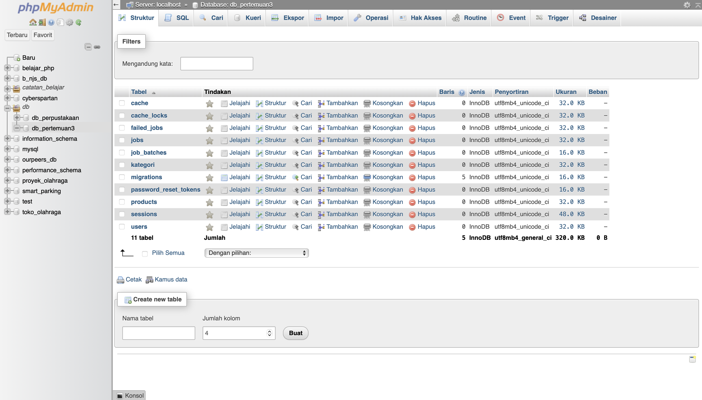
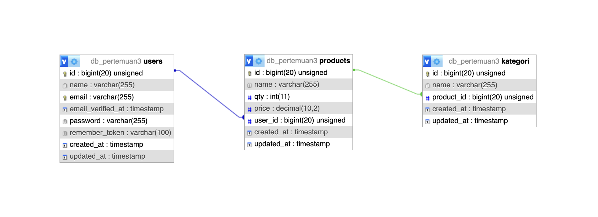

**PRAKTIKUM 1**
1. TAMPILAN AWAL 

**PRAKTIKUM 2**
1. TAMPILAN REGISTER 
2. TAMPILAN LOGIN 
3. TAMPILAN DASHBOARD 
4. TAMPILAN ABOUT 

**PRAKTIKUM 3**
1. Models | Kategori 
2. Models | NamaModel 
3. Models | Produk 
4. Models | User 
5. Migrations | Produk 
6. Migrations | Kategori 
7. Database 
8. ERD 

**PRAKTIKUM 4**
1. MEMBUAT PRODUCT CONTROLLER 

**PRAKTIKUM 5**

ADMIN
1. TAMPILAN SEBELUM PRODUK DITAMBAHKAN 
2. TAMPILAN SETELAH PRODUK DITAMBAHKAN 
3. TAMPILAN MELIHAT DETAIL PRODUK 
4. TAMPILAN EDIT PRODUK 
5. TAMPILAN SETELAH PRODUK DIEDIT 
6. TAMPILAN JIKA INGIN HAPUS PRODUK 
7. TAMPILAN JIKA PRODUK SUDAH DIHAPUS 

USER
1. TAMPILAN PRODUK JIKA ADA 
2. TAMPILAN JIKA PRODUK TIDAK ADA 

DATABASE 
1. DATABASE PRODUK 

**PRAKTIKUM 6**

VALIDASI TAMBAH PRODUK
1. 
2. 
3. 

VALIDASI EDIT PRODUK
1. 

